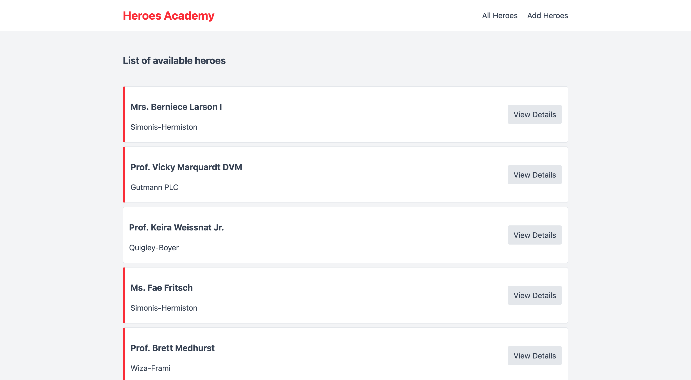

# 🦸‍♂️ Heroes Academy - Laravel Simple CRUD 🦸‍♀️

<p align="center">
  
</p>

<p align="center">
  <a href="https://laravel.com"></a>
  <a href="https://www.php.net">=8.1"></a>
  <a href="LICENSE"></a>
  <a href="https://github.com/Leonfarhan/laravel-simple-crud/stargazers"></a>
</p>

## 🌟 About The Project

**Heroes Academy** is a dynamic web application built with the Laravel framework. This application allows users to manage a list of superheroes (Heroes) and their home worlds (Universes) through an intuitive interface. A complete CRUD (Create, Read, Update, Delete) implementation facilitates data management.

---

## 📜 Table of Contents
1. [✨ Key Features](#-key-features)
2. [🛠️ Technologies Used](#️-technologies-used)
3. [⚙️ Prerequisites](#️-prerequisites)
4. [🚀 Installation Guide](#-installation-guide)
5. [🗂️ Project Structure](#️-project-structure)
6. [🤝 Contributing](#-contributing)
7. [📄 License](#-license)

---

## ✨ Key Features
-   🦸 **Hero Management**: Add, view, update, and delete hero data.
-   🌌 **Universe Management**: Each hero is associated with their universe.
-   📄 **Pagination**: The hero list is displayed with pagination for easy navigation.
-   🔍 **Complete Details**: View hero details including universe information.
-   🛡️ **Input Validation**: Server-side data validation for data integrity.
-   🌱 **Data Seeding**: Initial (dummy) data for heroes and universes using Seeders & Factories.
-   🎨 **Responsive Design**: Attractive and adaptive layout using Tailwind CSS.
-   🧩 **Blade Components**: Modular view structure with Blade Components.

## 🛠️ Technologies Used
-   **Backend**: PHP, Laravel 10.x
-   **Frontend**: HTML, Tailwind CSS, Blade Templates
-   **Database**: SQLite (default), MySQL, PostgreSQL (configurable)
-   **Build Tool**: Vite
-   **Development Tools**: Composer, NPM

## ⚙️ Prerequisites
Ensure your system meets the following requirements:
-   PHP >= 8.1
-   Composer version 2.x
-   Node.js >= 16.x & NPM >= 8.x
-   Git

## 🚀 Installation Guide

1.  **Clone the Repository:**
    ```bash
    git clone https://github.com/Leonfarhan/laravel-simple-crud
    cd laravel-simple-crud
    ```
    
2.  **Install Dependencies:**
    ```bash
    composer install
    npm install
    npm run build
    ```

3.  **Environment Configuration:**
    Copy the `.env.example` file to `.env` and adjust environment variables, especially the database connection.
    ```bash
    cp .env.example .env
    php artisan key:generate
    ```
    Example SQLite database configuration (the default in `.env.example` usually requires no changes if the `database.sqlite` file is created):
    ```env
    DB_CONNECTION=sqlite
    # DB_DATABASE=/absolute/path/to/your/database.sqlite # Ensure this path is correct if database.sqlite is not in the root
    ```
    If using MySQL, create a database and update `.env`:
    ```env
    DB_CONNECTION=mysql
    DB_HOST=127.0.0.1
    DB_PORT=3306
    DB_DATABASE=heroes_academy
    DB_USERNAME=root
    DB_PASSWORD=
    ```

4.  **Database Migration and Seeding:**
    This command will create the table structure and populate initial data.
    ```bash
    php artisan migrate --seed
    ```

5.  **Run the Application:**
    ```bash
    php artisan serve
    ```
    The application will be running at `http://localhost:8000`.

## 🗂️ Project Structure
Here is a brief overview of the important directories:
```
laravel-simple-crud/
├── app/
│   ├── Http/Controllers/
│   │   └── HeroController.php  # CRUD Logic for Heroes
│   └── Models/
│       ├── Hero.php            # Eloquent Model for Hero
│       └── Universe.php        # Eloquent Model for Universe
├── database/
│   ├── factories/              # Factory definitions for dummy data
│   ├── migrations/             # Database schema
│   └── seeders/                # Seeders for initial data
├── public/
│   └── Main-Heroes-Academy.png # Application screenshot
├── resources/
│   ├── css/
│   │   └── app.css             # Main styling (Tailwind)
│   └── views/
│       ├── components/         # Blade components (layout, card)
│       └── heroes/             # CRUD views for Heroes
├── routes/
│   └── web.php                 # Web route definitions
├── .env.example                # Example environment configuration file
├── composer.json               # PHP dependencies
├── package.json                # JavaScript dependencies
└── README.md                   # You are reading it!
```

## 🤝 Contributing
Contributions are very welcome! If you have ideas for improvements or find a bug, please:
1.  Fork this repository.
2.  Create a new branch (`git checkout -b feature/FeatureName`).
3.  Make your changes and commit them (`git commit -m 'Adding an Awesome Feature'`).
4.  Push to your branch (`git push origin feature/FeatureName`).
5.  Create a new Pull Request.

Please ensure your code follows the existing coding standards and include a clear description of the changes you've made.

## 📄 License
This project is licensed under the **MIT License**.

---
<p align="center">
  Made with ❤️ using Laravel & Tailwind CSS
</p>
